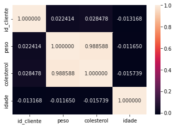
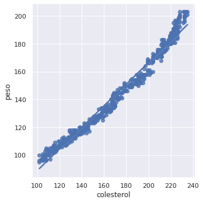

---
jupyter:
  colab:
    name: Desafio\_M1\_PlanoDeSaude.ipynb
  kernelspec:
    display_name: Python 3
    name: python3
  language_info:
    name: python
  nbformat: 4
  nbformat_minor: 0
---

<div class="cell markdown" id="dsJb9MDmj3JU">

\#Desafio do módulo 1 referente ao tratamento dos dados de clustering do
plano de saúde

</div>

<div class="cell markdown" id="OawZjGP0kAyb">

1.  Importando bibliotecas

</div>

<div class="cell code" execution_count="1" id="LL04TSDazy0y">

``` python
import pandas as pd
import matplotlib.pyplot as plt
import seaborn as sns
```

</div>

<div class="cell markdown" id="nlsqYB_skDRs">

1.  Trazendo base de dados

</div>

<div class="cell code" execution_count="45" id="e1QSZTNbDmP9">

``` python
df_clientes = pd.read_excel('/content/dados_clientes.xlsx')
df_estados = pd.read_csv('/content/estados_brasileiros.csv',encoding='latin-1',sep=';')
df_idade = pd.read_csv('/content/idade_clientes.csv',sep=';')
```

</div>

<div class="cell markdown" id="KaWRXhXFkGl0">

1.  Juntando base de dados e fazendo alguns tratamentos, como mudança de
    atributos nominais para inteiros e mudança nos id dos estados para
    os nomes dos estados

</div>

<div class="cell code" execution_count="3" id="qZsmmnxoDui8">

``` python
df = pd.merge(df_clientes,df_idade,how = 'outer')
df.loc[df.genero == 'Masculino','genero'] = 1
df.loc[df.genero == "Feminino","genero"] = 0
estados = df_estados.estado.values
count = 1
for x in estados:
  df.loc[df.id_estado == count,"id_estado"] = x
  count+=1
```

</div>

<div class="cell markdown" id="fU3wSKtbmVud">

1.  Verificando a existencia de valores nulos, e dropando se tiver

</div>

<div class="cell code" execution_count="4"
colab="{&quot;base_uri&quot;:&quot;https://localhost:8080/&quot;}"
id="DR3GV8L_LK-x" outputId="2e2b92c0-1df5-4204-878c-14386918bb35">

``` python
print(df.isnull().sum())
print(df.isna().sum())
df = df.dropna()
```

<div class="output stream stdout">

    id_cliente    0
    peso          5
    colesterol    0
    genero        0
    id_estado     0
    idade         0
    dtype: int64
    id_cliente    0
    peso          5
    colesterol    0
    genero        0
    id_estado     0
    idade         0
    dtype: int64

</div>

</div>

<div class="cell markdown" id="lDOakP-Kmas8">

1.  Realizando um mapa de calor para ver as variaveis que mais
    influenciam

</div>

<div class="cell code" execution_count="5"
colab="{&quot;height&quot;:270,&quot;base_uri&quot;:&quot;https://localhost:8080/&quot;}"
id="u6kDt5ckNvXI" outputId="541ac1f2-2f91-48d6-bd95-de0adb341b92">

``` python
import seaborn as sns
corr = df.corr()
ax = sns.heatmap(corr, annot=True, fmt="f")
```

<div class="output display_data">



</div>

</div>

<div class="cell markdown" id="9_kDB31smhDd">

1.  Deixando as variáveis que mais influenciam e exlcluindo as outras

</div>

<div class="cell code" execution_count="6" id="xuTZNVLiRVjx">

``` python
df_2 = df.loc[:,['colesterol','peso']]
```

</div>

<div class="cell markdown" id="HPkcvjP7mm4t">

1.  Analisando a correlação das variaveis

</div>

<div class="cell code" execution_count="7"
colab="{&quot;height&quot;:365,&quot;base_uri&quot;:&quot;https://localhost:8080/&quot;}"
id="M1ov_y9QRzpw" outputId="cfba1ef5-ffba-4646-d3cf-23f16d49fb25">

``` python
import seaborn as sns; sns.set_theme(color_codes=True)
tips = sns.load_dataset("tips")
g = sns.lmplot(x="colesterol", y="peso", data=df_2)
```

<div class="output display_data">



</div>

</div>

<div class="cell markdown" id="-Pcnkti4b4Li">

### Percebendo que existe uma forte correlação do peso com o colesterol, podemos criar um modelo de regressão linear para poder predizer o valores faltantes

</div>

<div class="cell markdown" id="GU-gz6XemquN">

1.  Vendo onde estão os valores nulos

</div>

<div class="cell code" execution_count="8"
colab="{&quot;base_uri&quot;:&quot;https://localhost:8080/&quot;}"
id="firdVhJ-cDKy" outputId="508ccc17-d266-459e-a9b5-26a5c57bbb2e">

``` python
df_clientes.isnull().sum()
```

<div class="output execute_result" execution_count="8">

    id_cliente    0
    peso          5
    colesterol    0
    genero        0
    id_estado     0
    dtype: int64

</div>

</div>

<div class="cell markdown" id="1jf_QdusmvL-">

1.  Com os valores nulos localizados, vou criar um modelo de regressão
    para poder preencher os dados vazios

</div>

<div class="cell code" execution_count="9" id="FRgTGgodcfeL">

``` python
y = df_2['peso']
x = df_2['colesterol']
input = list()
for input_colesterol in x:
  input.append([input_colesterol])
outp = list()
for outp_ in y:
  outp.append(outp_)
```

</div>

<div class="cell code" execution_count="10" id="0jq-Uf2_c18p">

``` python
from sklearn.linear_model import LinearRegression
reg = LinearRegression().fit(input, outp)
```

</div>

<div class="cell code" execution_count="11"
colab="{&quot;height&quot;:206,&quot;base_uri&quot;:&quot;https://localhost:8080/&quot;}"
id="69pz2qeXc8CL" outputId="517bfcde-ea00-4408-a5e2-6d9eda582e05">

``` python
df_clientes.loc[df_clientes['peso'].isnull()]
```

<div class="output execute_result" execution_count="11">

         id_cliente  peso  colesterol     genero  id_estado
    63           64   NaN         211  Masculino         12
    101         102   NaN         230   Feminino         24
    146         147   NaN         171  Masculino         23
    195         196   NaN         143   Feminino         15
    215         216   NaN         180  Masculino         13

</div>

</div>

<div class="cell markdown" id="hJOPES6TnTsj">

1.  Automatizando o processo de encontrar o valor nulo, colocar ele no
    preditor e depois substituir

</div>

<div class="cell code" execution_count="12" id="3a_9G5toerFU">

``` python
g = df_clientes.loc[df_clientes['peso'].isnull()].values
g = g.tolist()
for x in g:
  p = reg.predict([[x[2]]])[0]
  df_clientes.loc[df_clientes.id_cliente == x[0], 'peso'] = p
```

</div>

<div class="cell markdown" id="mc3v5mNSnbWN">

1.  As 3 proximas células são apenas uma reconstrução dos passos 1 a 6
    mas agora com os valores que antes estavam ausentes, presentes.

</div>

<div class="cell code" execution_count="13" id="-K1XlLYzg9JT">

``` python
df = pd.merge(df_clientes,df_idade,how = 'outer')
df.loc[df.genero == 'Masculino','genero'] = 1
df.loc[df.genero == "Feminino","genero"] = 0
estados = df_estados.estado.values
count = 1
for x in estados:
  df.loc[df.id_estado == count,"id_estado"] = x
  count+=1
```

</div>

<div class="cell code" execution_count="14"
colab="{&quot;base_uri&quot;:&quot;https://localhost:8080/&quot;}"
id="ZiFqsPDHhIvo" outputId="2fec9e12-a6b8-4672-87a7-2b1bf0589104">

``` python
print(df.isnull().sum())
```

<div class="output stream stdout">

    id_cliente    0
    peso          0
    colesterol    0
    genero        0
    id_estado     0
    idade         0
    dtype: int64

</div>

</div>

<div class="cell code" execution_count="15"
colab="{&quot;height&quot;:206,&quot;base_uri&quot;:&quot;https://localhost:8080/&quot;}"
id="F21GN246jOk0" outputId="df3de6b1-8dd0-4bb8-ef89-8049534db92e">

``` python
df_2 = df.loc[:,['colesterol','peso']]
df_2.head(5)
```

<div class="output execute_result" execution_count="15">

       colesterol   peso
    0         111  102.0
    1         135  115.0
    2         136  115.0
    3         167  140.0
    4         158  130.0

</div>

</div>

<div class="cell markdown" id="Ux0_HgthnmrP">

# Com a base de dados pronta, podemos iniciar o processo de clusterização

</div>

<div class="cell code" execution_count="16" id="Kxo8oPqDnuft">

``` python
from sklearn.cluster import KMeans
```

</div>

<div class="cell markdown" id="3sOZ-qHUFosF">

1.  Calcular a melhor quantidade de cluster utilizando WCSS

</div>

<div class="cell code" execution_count="55" id="1ULttlZOFvHN">

``` python
def calcular_wcss(dados):
  wcss = list()
  for x in range(1,11):
    km = KMeans(n_clusters= x,random_state=0)
    km.fit(dados)
    wcss.append(km.inertia_)
  return wcss
```

</div>

<div class="cell code" execution_count="56" id="XpzG3NzqGVDE">

``` python
data = df_2[['colesterol','peso']]
wcss = calcular_wcss(data)
tam = list()
for z in range(0,len(wcss)):
  tam.append(z)
```

</div>

<div class="cell markdown" id="7BJas3ncGwJF">

1.  Mostrar o gráfico do wcss

</div>

<div class="cell code" execution_count="28"
colab="{&quot;height&quot;:279,&quot;base_uri&quot;:&quot;https://localhost:8080/&quot;}"
id="jv-U5wqfG1S8" outputId="e6b744b1-1540-4e80-bd93-1a44e0030dc8">

``` python
import matplotlib.pyplot as plt
fig, ax = plt.subplots()
ax.plot(tam, wcss,linewidth=2.0)
plt.show()
```

<div class="output display_data">


</div>

</div>

<div class="cell markdown" id="n3jRh6oLImQ8">

1.  Criar o modelo e inserir na tabela

</div>

<div class="cell code" execution_count="30" id="pN7mRu_6IrfW">

``` python
clientes = KMeans(n_clusters= 4,random_state=0)
df['cluster'] = clientes.fit_predict(data)
```

</div>

<div class="cell code" execution_count="31"
colab="{&quot;height&quot;:424,&quot;base_uri&quot;:&quot;https://localhost:8080/&quot;}"
id="rHqQ-G_uJB1u" outputId="7eb45fea-f6f3-4b1d-ac62-f5510e755ccc">

``` python
df
```

<div class="output execute_result" execution_count="31">

         id_cliente   peso  colesterol genero            id_estado  idade  cluster
    0             1  102.0         111      1              Roraima     17        0
    1             2  115.0         135      1     Distrito Federal     28        0
    2             3  115.0         136      1             Amazonas     62        0
    3             4  140.0         167      0       Santa Catarina     55        3
    4             5  130.0         158      1              Sergipe     44        3
    ..          ...    ...         ...    ...                  ...    ...      ...
    542         543  172.0         207      1             Rondônia     20        2
    543         544  129.0         157      1                 Acre     66        3
    544         545  107.0         115      1                Ceará     36        0
    545         546  117.0         147      1  Rio Grande do Norte     57        3
    546         547  148.0         176      1       Espírito Santo     61        1

    [547 rows x 7 columns]

</div>

</div>

<div class="cell markdown" id="J4bw1U0OJy9N">

1.  Calcular os centróides dos clusters

</div>

<div class="cell code" execution_count="32"
colab="{&quot;base_uri&quot;:&quot;https://localhost:8080/&quot;}"
id="9qBmShxWJ2c9" outputId="aa31912f-9d53-442f-a480-268626b99d6f">

``` python
centroid = clientes.cluster_centers_
centroid
```

<div class="output execute_result" execution_count="32">

    array([[119.66666667, 106.91489362],
           [186.94117647, 152.91599368],
           [219.31333333, 184.68013763],
           [154.82481752, 128.12567565]])

</div>

</div>

<div class="cell markdown" id="fuUv8tK_J9TN">

1.  Plotar os gráficos

</div>

<div class="cell code" execution_count="61"
colab="{&quot;height&quot;:542,&quot;base_uri&quot;:&quot;https://localhost:8080/&quot;}"
id="0o30fDMxJ_ll" outputId="b3ff2caa-f5d9-4452-b99f-4c77b002c1f5">

``` python
import plotly.express as px  
import plotly.graph_objects as go

grafico = px.scatter(x=df['colesterol'],y=df['peso'],color=df['cluster'])
grafico_c = px.scatter(x=centroid[:,0],y=centroid[:,1],size=[7,7,7,7])
gr = go.Figure(data = grafico_c.data + grafico.data)
gr.show()
```

<div class="output display_data">

<html>
<head><meta charset="utf-8" /></head>
<body>
    <div>            <script src="https://cdnjs.cloudflare.com/ajax/libs/mathjax/2.7.5/MathJax.js?config=TeX-AMS-MML_SVG"></script><script type="text/javascript">if (window.MathJax) {MathJax.Hub.Config({SVG: {font: "STIX-Web"}});}</script>                <script type="text/javascript">window.PlotlyConfig = {MathJaxConfig: 'local'};</script>
        <script src="https://cdn.plot.ly/plotly-2.8.3.min.js"></script>                <div id="570b93c2-8a4d-4053-aed7-cf026d3d6d4d" class="plotly-graph-div" style="height:525px; width:100%;"></div>            <script type="text/javascript">                                    window.PLOTLYENV=window.PLOTLYENV || {};                                    if (document.getElementById("570b93c2-8a4d-4053-aed7-cf026d3d6d4d")) {                    Plotly.newPlot(                        "570b93c2-8a4d-4053-aed7-cf026d3d6d4d",                        [{"hovertemplate":"x=%{x}<br>y=%{y}<br>size=%{marker.size}<extra></extra>","legendgroup":"","marker":{"color":"#636efa","size":[7,7,7,7],"sizemode":"area","sizeref":0.0175,"symbol":"circle"},"mode":"markers","name":"","orientation":"v","showlegend":false,"x":[119.66666666666677,186.9411764705882,219.31333333333345,154.82481751824812],"xaxis":"x","y":[106.91489361702122,152.91599367974976,184.68013763243545,128.1256756490973],"yaxis":"y","type":"scatter"},{"hovertemplate":"x=%{x}<br>y=%{y}<br>color=%{marker.color}<extra></extra>","legendgroup":"","marker":{"color":[0,0,0,3,3,2,0,1,2,2,0,2,0,1,3,2,0,2,1,3,1,0,2,3,0,2,0,2,2,1,2,3,1,0,2,0,2,0,3,1,2,1,3,2,2,3,2,3,3,0,0,1,2,1,0,1,1,2,3,1,0,1,0,2,3,1,0,1,2,3,3,3,3,1,2,0,3,2,0,3,3,0,2,3,0,3,1,3,3,0,1,2,0,0,0,3,3,1,0,0,1,2,0,3,2,2,0,3,0,2,3,2,3,0,2,0,3,3,3,3,2,0,1,2,2,0,2,0,1,3,2,0,2,1,3,1,0,2,1,0,2,0,2,2,1,2,1,1,0,2,0,2,0,3,1,2,1,3,2,2,3,2,3,3,0,3,1,2,1,0,2,1,2,3,1,0,1,0,2,1,1,0,1,2,3,3,3,3,1,2,0,3,2,0,3,3,0,2,3,0,3,1,1,3,0,1,2,0,0,0,3,3,1,0,0,1,2,0,3,2,2,0,1,0,2,3,2,3,0,2,0,3,3,1,3,2,0,1,2,2,0,2,0,1,3,2,0,2,1,3,1,0,2,1,0,2,0,2,2,1,2,1,1,0,2,0,2,0,3,2,2,1,3,2,2,3,2,3,3,0,3,2,2,1,0,1,1,2,3,1,0,1,0,2,1,1,0,1,2,3,3,3,3,1,2,0,3,2,0,3,3,0,2,3,0,3,1,1,3,0,1,2,0,0,0,3,3,1,0,0,1,2,0,3,2,2,0,1,0,2,3,2,3,0,2,0,3,3,1,3,2,0,1,2,2,0,2,0,1,3,2,0,2,1,3,1,0,2,1,0,2,0,2,2,1,2,3,1,0,2,0,2,0,3,2,2,1,3,2,2,3,2,3,3,0,3,1,2,1,0,1,1,2,3,1,0,1,0,2,1,1,0,1,2,3,3,3,3,1,2,0,3,2,0,3,3,0,2,3,0,3,1,3,3,0,1,2,0,0,0,3,3,1,0,0,1,2,0,3,2,2,3,1,0,2,3,2,3,0,2,0,3,3,1,3,2,3,1,2,2,0,2,0,1,3,2,0,2,1,3,1,0,2,1,0,2,0,2,2,1,2,1,1,0,2,0,2,0,3,2,2,1,3,2,2,3,2,3,3,0,3,1,2,1,0,1,1,2,3,1,0,1,0,2,3,1,0,1,2,1,3,3,3,1,2,0,3,2,0,3,3,0,2,3,0,3,1],"coloraxis":"coloraxis","symbol":"circle"},"mode":"markers","name":"","orientation":"v","showlegend":false,"x":[111,135,136,167,158,227,131,176,223,221,116,222,102,192,152,213,125,204,189,163,189,122,228,168,102,218,123,222,208,183,204,167,188,126,213,122,225,105,155,203,225,177,139,224,207,158,218,164,154,118,138,199,219,183,128,197,196,208,152,175,129,185,107,211,167,185,110,194,221,166,143,163,158,191,216,106,146,220,131,147,141,130,204,152,111,139,172,168,148,123,189,220,120,106,105,157,149,185,106,115,177,230,108,140,214,216,130,169,110,209,162,214,145,116,209,116,139,143,168,158,232,136,180,228,222,117,224,104,195,156,213,133,208,195,163,195,124,231,172,104,221,128,222,214,184,204,171,195,132,214,123,233,107,162,204,227,185,142,225,212,161,220,168,155,125,144,201,222,189,132,204,201,211,156,179,129,185,107,213,172,193,114,202,222,168,146,170,165,196,224,108,149,224,136,152,143,135,211,156,115,143,179,173,148,127,194,225,127,106,112,164,151,191,110,116,180,235,108,141,219,219,138,169,116,212,162,220,151,119,212,111,142,138,172,158,228,134,181,231,223,121,222,102,195,156,214,132,204,190,167,195,127,235,171,110,221,128,226,208,191,205,173,191,128,220,126,232,108,159,211,232,182,145,224,209,160,219,170,161,122,141,204,226,187,129,199,199,214,159,176,129,187,109,212,170,191,116,202,226,166,151,170,166,193,218,109,152,220,133,152,142,131,204,153,114,144,172,176,150,129,190,226,128,106,107,159,157,192,110,115,183,233,112,146,222,216,134,174,114,211,167,214,145,120,217,113,141,140,171,163,232,131,184,225,223,121,223,105,197,160,218,131,211,194,169,189,128,228,169,108,219,124,224,214,190,205,167,190,128,217,126,228,105,162,211,227,178,146,227,208,163,225,167,162,125,144,199,226,183,136,199,204,215,155,179,133,186,111,219,173,185,118,199,226,169,144,166,166,198,222,110,154,226,135,151,146,133,205,154,116,145,174,168,156,124,196,227,122,106,110,158,154,190,110,120,180,232,110,142,222,218,138,176,115,211,168,216,147,124,215,117,139,138,171,158,232,139,178,224,224,116,223,109,193,155,221,130,212,190,169,191,122,234,175,108,220,126,227,216,188,205,172,192,129,219,127,228,105,159,205,228,178,139,232,212,162,226,171,159,120,143,200,221,184,134,200,201,210,159,178,137,190,110,213,170,193,113,196,222,174,143,169,165,194,217,113,150,223,133,149,149,130,207,157,115,147,176],"xaxis":"x","y":[102.0,115.0,115.0,140.0,130.0,198.0,114.0,145.0,191.0,186.0,104.0,188.0,96.0,156.0,125.0,178.0,109.0,168.0,152.0,133.0,153.0,107.0,199.0,140.0,95.0,183.0,108.0,190.0,174.0,149.0,169.0,138.0,151.0,109.0,178.0,106.0,195.0,96.0,129.0,166.0,197.0,148.0,117.0,193.0,170.0,130.0,183.0,134.0,128.0,105.0,115.0,166.0,183.0,149.0,110.0,164.0,157.0,170.0,124.0,145.0,113.0,150.0,100.0,175.11959719640208,139.0,150.0,101.0,157.0,187.0,137.0,121.0,132.0,130.0,156.0,180.0,100.0,122.0,185.0,113.0,123.0,119.0,113.0,168.0,126.0,102.0,116.0,144.0,140.0,124.0,108.0,154.0,185.0,106.0,97.0,96.0,129.0,124.0,149.0,97.0,102.0,146.0,189.90104766892355,100.0,118.0,179.0,179.0,113.0,142.0,101.0,174.0,131.0,179.0,122.0,105.0,176.0,103.0,120.0,118.0,143.0,134.0,203.0,116.0,150.0,192.0,187.0,107.0,192.0,97.0,157.0,128.0,183.0,112.0,173.0,156.0,137.0,156.0,112.0,203.0,141.0,97.0,186.0,113.0,195.0,175.0,154.0,173.0,144.00075409635687,152.0,114.0,181.0,111.0,200.0,100.0,134.0,167.0,198.0,151.0,121.0,196.0,171.0,135.0,186.0,138.0,133.0,107.0,120.0,168.0,184.0,154.0,115.0,168.0,161.0,171.0,129.0,150.0,118.0,154.0,103.0,180.0,141.0,152.0,104.0,159.0,191.0,142.0,123.0,135.0,132.0,158.0,181.0,105.0,126.0,186.0,116.0,124.0,122.21756392632523,115.0,173.0,128.0,103.0,120.0,146.0,145.0,125.0,109.0,156.0,187.0,110.0,100.0,97.0,133.0,128.0,154.0,100.0,104.0,151.00249379386705,203.0,104.0,119.0,181.0,180.0,116.0,144.0,102.0,176.0,135.0,184.0,124.0,110.0,180.0,103.0,117.0,120.0,145.0,133.0,201.0,117.0,146.0,195.0,188.0,108.0,191.0,100.0,158.0,127.0,181.0,113.0,171.0,153.0,137.0,154.0,112.0,201.0,141.0,100.0,185.0,111.0,191.0,176.0,150.0,171.0,140.0,153.0,111.0,180.0,107.0,197.0,101.0,132.0,168.0,200.0,150.0,119.0,197.0,172.0,134.0,185.0,135.0,132.0,109.0,116.0,170.0,187.0,154.0,111.0,169.0,161.0,174.0,125.0,148.0,117.0,154.0,104.0,183.0,142.0,155.0,105.0,160.0,191.0,140.0,123.0,136.0,132.0,158.0,182.0,104.0,126.0,188.0,118.0,127.0,123.0,118.0,169.0,128.0,106.0,119.0,147.0,141.0,125.0,109.0,158.0,190.0,110.0,99.0,98.0,134.0,129.0,154.0,100.0,107.0,149.0,203.0,101.0,119.0,182.0,181.0,115.0,145.0,102.0,176.0,134.0,183.0,123.0,108.0,177.0,104.0,117.0,117.0,145.0,134.0,199.0,115.0,149.0,192.0,188.0,107.0,190.0,98.0,158.0,128.0,180.0,110.0,172.0,157.0,137.0,158.0,110.0,203.0,145.0,96.0,186.0,110.0,194.0,177.0,152.0,172.0,140.0,154.0,113.0,179.0,111.0,196.0,101.0,131.0,171.0,199.0,151.0,121.0,196.0,174.0,135.0,184.0,137.0,129.0,108.0,116.0,168.0,184.0,151.0,114.0,167.0,160.0,175.0,127.0,146.0,118.0,151.0,105.0,180.0,140.0,155.0,106.0,160.0,192.0,138.0,122.0,135.0,132.0,158.0,184.0,101.0,126.0,188.0,118.0,127.0,123.0,117.0,172.0,127.0,104.0,121.0,148.0,141.0,128.0,113.0,155.0,189.0,108.0,98.0,100.0,134.0,125.0,151.0,100.0,107.0,147.0,200.0,101.0,120.0,181.0,182.0,117.0,145.0,106.0,179.0,134.0,180.0,126.0,110.0,180.0,103.0,116.0,119.0,144.0,133.0,199.0,115.0,150.0,192.0,188.0,109.0,189.0,101.0,159.0,128.0,182.0,111.0,171.0,154.0,134.0,157.0,112.0,203.0,142.0,97.0,187.0,111.0,194.0,176.0,153.0,171.0,142.0,153.0,113.0,183.0,108.0,200.0,99.0,131.0,171.0,200.0,152.0,119.0,196.0,173.0,132.0,185.0,138.0,132.0,110.0,119.0,167.0,188.0,151.0,112.0,166.0,158.0,172.0,127.0,150.0,115.0,151.0,103.0,181.0,141.0,152.0,105.0,162.0,190.0,141.0,122.0,136.0,131.0,157.0,181.0,103.0,127.0,189.0,114.0,125.0,123.0,116.0,172.0,129.0,107.0,117.0,148.0],"yaxis":"y","type":"scatter"}],                        {"template":{"data":{"bar":[{"error_x":{"color":"#2a3f5f"},"error_y":{"color":"#2a3f5f"},"marker":{"line":{"color":"#E5ECF6","width":0.5},"pattern":{"fillmode":"overlay","size":10,"solidity":0.2}},"type":"bar"}],"barpolar":[{"marker":{"line":{"color":"#E5ECF6","width":0.5},"pattern":{"fillmode":"overlay","size":10,"solidity":0.2}},"type":"barpolar"}],"carpet":[{"aaxis":{"endlinecolor":"#2a3f5f","gridcolor":"white","linecolor":"white","minorgridcolor":"white","startlinecolor":"#2a3f5f"},"baxis":{"endlinecolor":"#2a3f5f","gridcolor":"white","linecolor":"white","minorgridcolor":"white","startlinecolor":"#2a3f5f"},"type":"carpet"}],"choropleth":[{"colorbar":{"outlinewidth":0,"ticks":""},"type":"choropleth"}],"contour":[{"colorbar":{"outlinewidth":0,"ticks":""},"colorscale":[[0.0,"#0d0887"],[0.1111111111111111,"#46039f"],[0.2222222222222222,"#7201a8"],[0.3333333333333333,"#9c179e"],[0.4444444444444444,"#bd3786"],[0.5555555555555556,"#d8576b"],[0.6666666666666666,"#ed7953"],[0.7777777777777778,"#fb9f3a"],[0.8888888888888888,"#fdca26"],[1.0,"#f0f921"]],"type":"contour"}],"contourcarpet":[{"colorbar":{"outlinewidth":0,"ticks":""},"type":"contourcarpet"}],"heatmap":[{"colorbar":{"outlinewidth":0,"ticks":""},"colorscale":[[0.0,"#0d0887"],[0.1111111111111111,"#46039f"],[0.2222222222222222,"#7201a8"],[0.3333333333333333,"#9c179e"],[0.4444444444444444,"#bd3786"],[0.5555555555555556,"#d8576b"],[0.6666666666666666,"#ed7953"],[0.7777777777777778,"#fb9f3a"],[0.8888888888888888,"#fdca26"],[1.0,"#f0f921"]],"type":"heatmap"}],"heatmapgl":[{"colorbar":{"outlinewidth":0,"ticks":""},"colorscale":[[0.0,"#0d0887"],[0.1111111111111111,"#46039f"],[0.2222222222222222,"#7201a8"],[0.3333333333333333,"#9c179e"],[0.4444444444444444,"#bd3786"],[0.5555555555555556,"#d8576b"],[0.6666666666666666,"#ed7953"],[0.7777777777777778,"#fb9f3a"],[0.8888888888888888,"#fdca26"],[1.0,"#f0f921"]],"type":"heatmapgl"}],"histogram":[{"marker":{"pattern":{"fillmode":"overlay","size":10,"solidity":0.2}},"type":"histogram"}],"histogram2d":[{"colorbar":{"outlinewidth":0,"ticks":""},"colorscale":[[0.0,"#0d0887"],[0.1111111111111111,"#46039f"],[0.2222222222222222,"#7201a8"],[0.3333333333333333,"#9c179e"],[0.4444444444444444,"#bd3786"],[0.5555555555555556,"#d8576b"],[0.6666666666666666,"#ed7953"],[0.7777777777777778,"#fb9f3a"],[0.8888888888888888,"#fdca26"],[1.0,"#f0f921"]],"type":"histogram2d"}],"histogram2dcontour":[{"colorbar":{"outlinewidth":0,"ticks":""},"colorscale":[[0.0,"#0d0887"],[0.1111111111111111,"#46039f"],[0.2222222222222222,"#7201a8"],[0.3333333333333333,"#9c179e"],[0.4444444444444444,"#bd3786"],[0.5555555555555556,"#d8576b"],[0.6666666666666666,"#ed7953"],[0.7777777777777778,"#fb9f3a"],[0.8888888888888888,"#fdca26"],[1.0,"#f0f921"]],"type":"histogram2dcontour"}],"mesh3d":[{"colorbar":{"outlinewidth":0,"ticks":""},"type":"mesh3d"}],"parcoords":[{"line":{"colorbar":{"outlinewidth":0,"ticks":""}},"type":"parcoords"}],"pie":[{"automargin":true,"type":"pie"}],"scatter":[{"marker":{"colorbar":{"outlinewidth":0,"ticks":""}},"type":"scatter"}],"scatter3d":[{"line":{"colorbar":{"outlinewidth":0,"ticks":""}},"marker":{"colorbar":{"outlinewidth":0,"ticks":""}},"type":"scatter3d"}],"scattercarpet":[{"marker":{"colorbar":{"outlinewidth":0,"ticks":""}},"type":"scattercarpet"}],"scattergeo":[{"marker":{"colorbar":{"outlinewidth":0,"ticks":""}},"type":"scattergeo"}],"scattergl":[{"marker":{"colorbar":{"outlinewidth":0,"ticks":""}},"type":"scattergl"}],"scattermapbox":[{"marker":{"colorbar":{"outlinewidth":0,"ticks":""}},"type":"scattermapbox"}],"scatterpolar":[{"marker":{"colorbar":{"outlinewidth":0,"ticks":""}},"type":"scatterpolar"}],"scatterpolargl":[{"marker":{"colorbar":{"outlinewidth":0,"ticks":""}},"type":"scatterpolargl"}],"scatterternary":[{"marker":{"colorbar":{"outlinewidth":0,"ticks":""}},"type":"scatterternary"}],"surface":[{"colorbar":{"outlinewidth":0,"ticks":""},"colorscale":[[0.0,"#0d0887"],[0.1111111111111111,"#46039f"],[0.2222222222222222,"#7201a8"],[0.3333333333333333,"#9c179e"],[0.4444444444444444,"#bd3786"],[0.5555555555555556,"#d8576b"],[0.6666666666666666,"#ed7953"],[0.7777777777777778,"#fb9f3a"],[0.8888888888888888,"#fdca26"],[1.0,"#f0f921"]],"type":"surface"}],"table":[{"cells":{"fill":{"color":"#EBF0F8"},"line":{"color":"white"}},"header":{"fill":{"color":"#C8D4E3"},"line":{"color":"white"}},"type":"table"}]},"layout":{"annotationdefaults":{"arrowcolor":"#2a3f5f","arrowhead":0,"arrowwidth":1},"autotypenumbers":"strict","coloraxis":{"colorbar":{"outlinewidth":0,"ticks":""}},"colorscale":{"diverging":[[0,"#8e0152"],[0.1,"#c51b7d"],[0.2,"#de77ae"],[0.3,"#f1b6da"],[0.4,"#fde0ef"],[0.5,"#f7f7f7"],[0.6,"#e6f5d0"],[0.7,"#b8e186"],[0.8,"#7fbc41"],[0.9,"#4d9221"],[1,"#276419"]],"sequential":[[0.0,"#0d0887"],[0.1111111111111111,"#46039f"],[0.2222222222222222,"#7201a8"],[0.3333333333333333,"#9c179e"],[0.4444444444444444,"#bd3786"],[0.5555555555555556,"#d8576b"],[0.6666666666666666,"#ed7953"],[0.7777777777777778,"#fb9f3a"],[0.8888888888888888,"#fdca26"],[1.0,"#f0f921"]],"sequentialminus":[[0.0,"#0d0887"],[0.1111111111111111,"#46039f"],[0.2222222222222222,"#7201a8"],[0.3333333333333333,"#9c179e"],[0.4444444444444444,"#bd3786"],[0.5555555555555556,"#d8576b"],[0.6666666666666666,"#ed7953"],[0.7777777777777778,"#fb9f3a"],[0.8888888888888888,"#fdca26"],[1.0,"#f0f921"]]},"colorway":["#636efa","#EF553B","#00cc96","#ab63fa","#FFA15A","#19d3f3","#FF6692","#B6E880","#FF97FF","#FECB52"],"font":{"color":"#2a3f5f"},"geo":{"bgcolor":"white","lakecolor":"white","landcolor":"#E5ECF6","showlakes":true,"showland":true,"subunitcolor":"white"},"hoverlabel":{"align":"left"},"hovermode":"closest","mapbox":{"style":"light"},"paper_bgcolor":"white","plot_bgcolor":"#E5ECF6","polar":{"angularaxis":{"gridcolor":"white","linecolor":"white","ticks":""},"bgcolor":"#E5ECF6","radialaxis":{"gridcolor":"white","linecolor":"white","ticks":""}},"scene":{"xaxis":{"backgroundcolor":"#E5ECF6","gridcolor":"white","gridwidth":2,"linecolor":"white","showbackground":true,"ticks":"","zerolinecolor":"white"},"yaxis":{"backgroundcolor":"#E5ECF6","gridcolor":"white","gridwidth":2,"linecolor":"white","showbackground":true,"ticks":"","zerolinecolor":"white"},"zaxis":{"backgroundcolor":"#E5ECF6","gridcolor":"white","gridwidth":2,"linecolor":"white","showbackground":true,"ticks":"","zerolinecolor":"white"}},"shapedefaults":{"line":{"color":"#2a3f5f"}},"ternary":{"aaxis":{"gridcolor":"white","linecolor":"white","ticks":""},"baxis":{"gridcolor":"white","linecolor":"white","ticks":""},"bgcolor":"#E5ECF6","caxis":{"gridcolor":"white","linecolor":"white","ticks":""}},"title":{"x":0.05},"xaxis":{"automargin":true,"gridcolor":"white","linecolor":"white","ticks":"","title":{"standoff":15},"zerolinecolor":"white","zerolinewidth":2},"yaxis":{"automargin":true,"gridcolor":"white","linecolor":"white","ticks":"","title":{"standoff":15},"zerolinecolor":"white","zerolinewidth":2}}}},                        {"responsive": true}                    ).then(function(){
                            
var gd = document.getElementById('570b93c2-8a4d-4053-aed7-cf026d3d6d4d');
var x = new MutationObserver(function (mutations, observer) {{
        var display = window.getComputedStyle(gd).display;
        if (!display || display === 'none') {{
            console.log([gd, 'removed!']);
            Plotly.purge(gd);
            observer.disconnect();
        }}
}});

// Listen for the removal of the full notebook cells
var notebookContainer = gd.closest('#notebook-container');
if (notebookContainer) {{
    x.observe(notebookContainer, {childList: true});
}}

// Listen for the clearing of the current output cell
var outputEl = gd.closest('.output');
if (outputEl) {{
    x.observe(outputEl, {childList: true});
}}

                        })                };                            </script>        </div>
</body>
</html>

</div>

</div>

<div class="cell markdown" id="GsO9bF1EM8se">

1.  Segmentar os clientes

</div>

<div class="cell code" execution_count="38" id="VJHkTYH_NARN">

``` python
df_final = df
df_final.loc[df_final['cluster']==0,"Grupo"] = "Baixo Risco"
df_final.loc[df_final['cluster']==3,"Grupo"] = "Risco Moderado Baixo"
df_final.loc[df_final['cluster']==1,"Grupo"] = "Risco Moderado Alto"
df_final.loc[df_final['cluster']==2,"Grupo"] = "Alto Risco"
```

</div>

<div class="cell markdown" id="wHFzWQp0Np-X">

1.  Resultado Final

</div>

<div class="cell code" execution_count="39"
colab="{&quot;height&quot;:424,&quot;base_uri&quot;:&quot;https://localhost:8080/&quot;}"
id="y_1wVwGwNpP2" outputId="528f4408-aba9-4c28-d314-e48fddb04fa1">

``` python
df_final
```

<div class="output execute_result" execution_count="39">

         id_cliente   peso  colesterol genero            id_estado  idade  \
    0             1  102.0         111      1              Roraima     17   
    1             2  115.0         135      1     Distrito Federal     28   
    2             3  115.0         136      1             Amazonas     62   
    3             4  140.0         167      0       Santa Catarina     55   
    4             5  130.0         158      1              Sergipe     44   
    ..          ...    ...         ...    ...                  ...    ...   
    542         543  172.0         207      1             Rondônia     20   
    543         544  129.0         157      1                 Acre     66   
    544         545  107.0         115      1                Ceará     36   
    545         546  117.0         147      1  Rio Grande do Norte     57   
    546         547  148.0         176      1       Espírito Santo     61   

         cluster                 Grupo  
    0          0           Baixo Risco  
    1          0           Baixo Risco  
    2          0           Baixo Risco  
    3          3  Risco Moderado Baixo  
    4          3  Risco Moderado Baixo  
    ..       ...                   ...  
    542        2            Alto Risco  
    543        3  Risco Moderado Baixo  
    544        0           Baixo Risco  
    545        3  Risco Moderado Baixo  
    546        1   Risco Moderado Alto  

    [547 rows x 8 columns]

</div>

</div>

<div class="cell markdown" id="ZFclMUROOGW-">

1.  Analises

</div>

<div class="cell code" execution_count="60"
colab="{&quot;height&quot;:206,&quot;base_uri&quot;:&quot;https://localhost:8080/&quot;}"
id="I9lVN4sqOHlX" outputId="2b1ffae7-4bd2-4c5a-961b-ab1a4958b0b7">

``` python
df_final.groupby('Grupo')['idade'].describe()
```

<div class="output execute_result" execution_count="60">

                          count        mean       std    min         25%    50%  \
    Grupo                                                                         
    Alto Risco            153.0  184.353076  9.693192  168.0  176.000000  184.0   
    Baixo Risco           141.0  106.914894  6.195032   95.0  102.000000  107.0   
    Risco Moderado Alto   116.0  152.525890  6.919979  140.0  148.000000  152.0   
    Risco Moderado Baixo  137.0  128.125676  7.192864  115.0  122.217564  128.0   

                            75%    max  
    Grupo                               
    Alto Risco            191.0  203.0  
    Baixo Risco           112.0  118.0  
    Risco Moderado Alto   157.0  169.0  
    Risco Moderado Baixo  134.0  143.0  

</div>

</div>

<div class="cell code" execution_count="41"
colab="{&quot;height&quot;:206,&quot;base_uri&quot;:&quot;https://localhost:8080/&quot;}"
id="lUFPEDlFOWT3" outputId="882b6b81-dd10-4d4a-cdf5-ee2b02ff7f8c">

``` python
df_final.groupby('Grupo')['id_estado'].describe()
```

<div class="output execute_result" execution_count="41">

                         count unique                 top freq
    Grupo                                                     
    Alto Risco             153     27   Rio Grande do Sul   10
    Baixo Risco            141     27            Amazonas   10
    Risco Moderado Alto    116     27  Mato Grosso do Sul    7
    Risco Moderado Baixo   137     27             Sergipe    9

</div>

</div>

<div class="cell code" execution_count="43"
colab="{&quot;height&quot;:363,&quot;base_uri&quot;:&quot;https://localhost:8080/&quot;}"
id="xZd1KXNuOeX3" outputId="2d60678d-6bf4-4d24-9b86-140a56e97449">

``` python
df_final.query('Grupo == "Alto Risco" & id_estado == "Rio Grande do Sul"')
```

<div class="output execute_result" execution_count="43">

         id_cliente   peso  colesterol genero          id_estado  idade  cluster  \
    68           69  187.0         221      0  Rio Grande do Sul     35        2   
    105         106  179.0         216      1  Rio Grande do Sul     56        2   
    260         261  171.0         205      1  Rio Grande do Sul     34        2   
    312         313  169.0         204      1  Rio Grande do Sul     33        2   
    334         335  182.0         222      1  Rio Grande do Sul     68        2   
    372         373  194.0         224      0  Rio Grande do Sul     38        2   
    373         374  177.0         214      1  Rio Grande do Sul     18        2   
    375         376  172.0         205      1  Rio Grande do Sul     50        2   
    402         403  175.0         215      0  Rio Grande do Sul     45        2   
    408         409  180.0         219      1  Rio Grande do Sul     19        2   

              Grupo  
    68   Alto Risco  
    105  Alto Risco  
    260  Alto Risco  
    312  Alto Risco  
    334  Alto Risco  
    372  Alto Risco  
    373  Alto Risco  
    375  Alto Risco  
    402  Alto Risco  
    408  Alto Risco  

</div>

</div>

<div class="cell code" execution_count="63"
colab="{&quot;height&quot;:332,&quot;base_uri&quot;:&quot;https://localhost:8080/&quot;}"
id="UJMeGrIpO-an" outputId="c7fa1c6c-4f32-4dcf-8697-1d88b27a5193">

``` python
df_final.groupby(['Grupo','genero'])['peso'].describe()
```

<div class="output execute_result" execution_count="63">

                                 count        mean        std    min     25%  \
    Grupo                genero                                                
    Alto Risco           0        63.0  186.046048   7.869997  168.0  180.50   
                         1        90.0  183.167996  10.671058  168.0  173.25   
    Baixo Risco          0        65.0  108.323077   6.359313   96.0  104.00   
                         1        76.0  105.710526   5.825955   95.0  101.75   
    Risco Moderado Alto  0        63.0  152.476190   7.111683  140.0  145.00   
                         1        53.0  152.584967   6.752275  140.0  148.00   
    Risco Moderado Baixo 0        75.0  130.122901   7.263788  116.0  125.00   
                         1        62.0  125.709677   6.364314  115.0  120.25   

                                   50%     75%    max  
    Grupo                genero                        
    Alto Risco           0       186.0  191.50  203.0  
                         1       181.5  189.75  203.0  
    Baixo Risco          0       110.0  113.00  118.0  
                         1       105.0  110.00  118.0  
    Risco Moderado Alto  0       154.0  157.50  169.0  
                         1       151.0  154.00  168.0  
    Risco Moderado Baixo 0       131.0  136.00  143.0  
                         1       125.5  131.00  140.0  

</div>

</div>
